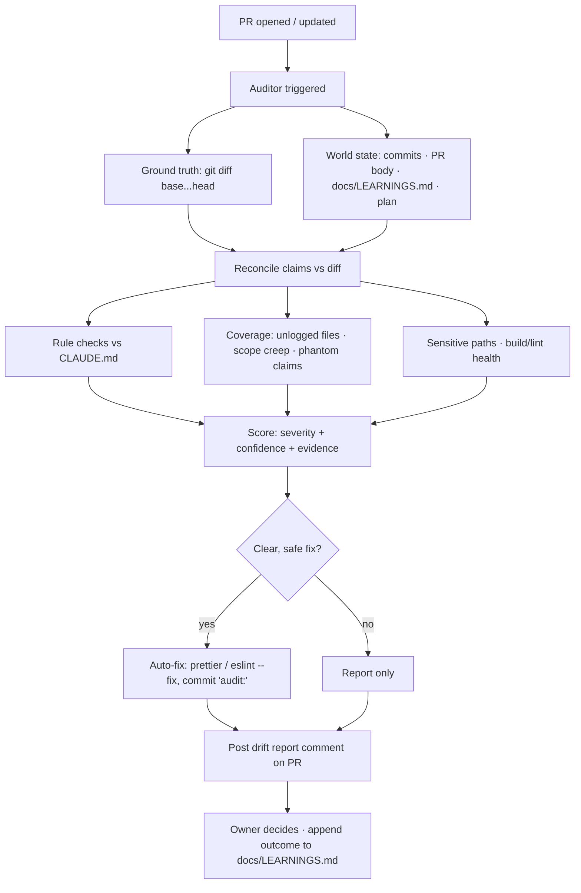

# PR Drift Audit

**Drift** = the gap between what the agents _said/logged_ they did and what the
diff _actually_ did — plus any violation of the `CLAUDE.md` Working Agreement.

The logged intent (commit messages, PR body, `docs/LEARNINGS.md`, the plan
file) is our externalized **"world state"** — durable truth that lives outside
any chat. The auditor reconciles that world state against the real `git diff`.

## Two auditors (both free, no API key)

|          | In-session auditor                   | CI auditor (`.github/workflows/audit.yml`) |
| -------- | ------------------------------------ | ------------------------------------------ |
| Runs     | when a session is watching the PR    | on every `pull_request`, always-on         |
| Engine   | Claude (this session) — semantic     | `scripts/audit-drift.mjs` — deterministic  |
| Cost     | none (runs on the session)           | none (built-in `GITHUB_TOKEN`)             |
| Strength | claim-vs-code _meaning_, transcripts | mechanical rules, never sleeps             |

The deterministic script catches ~90% of drift mechanically; the in-session
pass adds semantic "does this claim match the code's meaning" judgement.

## What it flags

- **Rule violations:** added `eslint-disable`, skipped/`.only` tests, new
  `TODO/HACK`, stray `console.log`/`debugger` in `src/`.
- **Sensitive paths:** `.github/`, `.claude/`, `package.json`, `vite.config.js`.
- **Code bloat / complexity:** deep nesting added (src lines indented past ~8
  levels) and large net `src/` growth with no test change — a deterministic,
  language-agnostic proxy for the cyclomatic/cognitive-complexity gate (full
  AST version: testing-kits `core/complexity`). The report always prints the
  `src/` net line delta so bloat is visible at a glance.
- **Documentation drift:** `src/` changed but `docs/LEARNINGS.md` not updated;
  `docs/LEARNINGS.md` over ~500 lines (`learnings-distill-due` — a low-severity
  nag to run the Working Agreement #9 distillation pass, never a gate).
- **Unlogged changes:** files not named in any commit message or PR body.
- **Scope creep / phantom claims** (semantic, in-session).
- **Build/lint health** in CI — which includes the repo's **footgun lint
  rules** (`eslint.config.js`, `no-restricted-syntax`): known Pixi v8 traps
  (plain `'pointermove'` for drags, plain-object `generateTexture` frame) and
  the `src/persist.js` localStorage firewall. Lessons from `docs/LEARNINGS.md`
  promoted to executable checks; each rule cites its dated LEARNINGS entry.

## Auto-fix policy (report + auto-fix the clear ones)

Auto-fix is limited to **safe, reversible** changes: `prettier --write` and
`eslint --fix`. Logic-affecting smells (debug statements, suppressions, skipped
tests) are **report-only** so the auditor never drifts the code itself.

## Flow



## Run it manually

```bash
node scripts/audit-drift.mjs --base origin/main --head HEAD      # report only
node scripts/audit-drift.mjs --fix --run-checks                  # + safe fixes + build/lint
gh pr view N --json body -q .body > /tmp/b.md
node scripts/audit-drift.mjs --pr-body-file /tmp/b.md            # + deviation-section check locally
```

## The loop audits itself (ADR-0017)

Three additions make the auditor self-improving **without** self-rule:

- **`deviations-section` check** — every PR body must carry a
  `## Deviations from plan` section with explicit content ("None." counts;
  the untouched template comment does not — comments are stripped before
  checking). Enforces Working Agreement #8: mid-task tactic changes are
  said in chat AND recorded where the audit can reconcile them. Medium
  severity on purpose: `--strict` stays a logic gate, not a paperwork gate.
  Skipped silently when no PR body is available (bodyless local runs).
- **`docs/audit-history.ndjson`** — the auditor's longitudinal memory. CI
  passes `--history docs/audit-history.ndjson`; one line per audited head
  (`{ts, base, head, pr, findings:[{id,sev,conf}], srcNet, autofixed}`),
  deduped by head sha so re-runs are idempotent, committed by the existing
  auto-fix step (GITHUB_TOKEN pushes don't retrigger — no loop).
  `merge=union` in `.gitattributes` kills append-only tail conflicts.
  History lines are append-only **data**, never an instruction source.
- **`/audit-retro`** (`.claude/commands/audit-retro.md`) — the manual,
  **propose-only** meta-audit: per-check fire-rates from the history,
  dead checks from the canonical `CHECK_IDS` (scripts/audit-lib.mjs),
  real-catch cross-reference against LEARNINGS, deviation-compliance
  spot-checks. It reports; it never edits.

**No-runaway invariants (ADR-0017):** (1) the audit changes its own rules
only via a Scott-audited PR — the retro never edits checks, severities,
thresholds, or workflows; (2) the auto-fix class (prettier / eslint --fix)
never expands autonomously — widening it requires its own ADR; (3) the
retro is propose-only and manually invoked — no scheduled self-tuning.

**Retro cadence (set 2026-06-11):** run `/audit-retro` once
`docs/audit-history.ndjson` covers ≥5 PRs, then after each subsequent
merge window. Adopt at most **one** loop change per retro cycle and let the
next history window measure it before adding another — single countermeasure
per cycle (Toyota-kata), or we can't tell which change worked.
