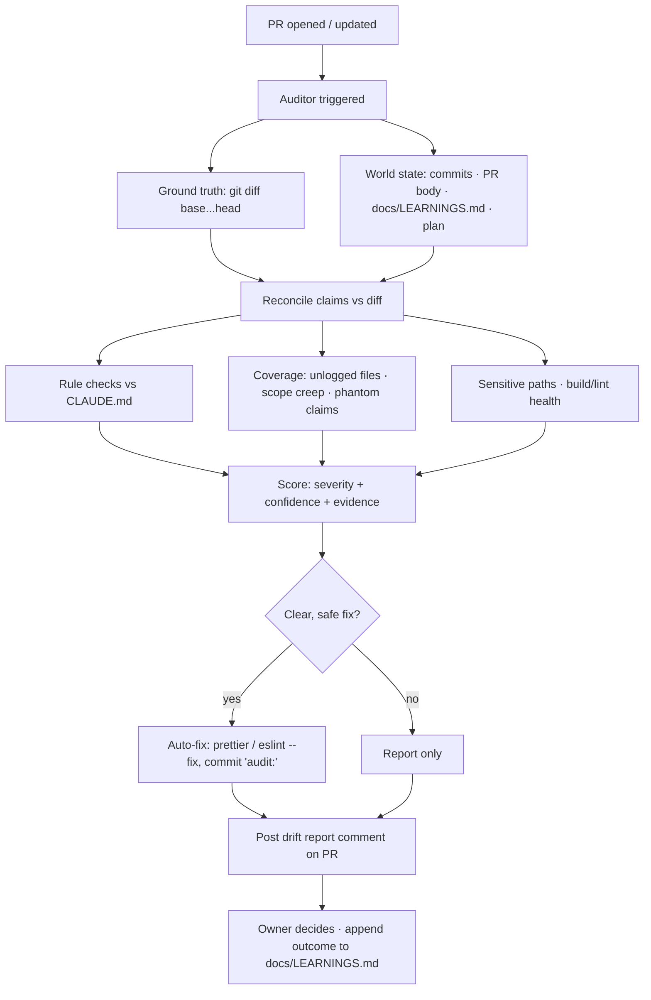

# PR Drift Audit

**Drift** = the gap between what the agents _said/logged_ they did and what the
diff _actually_ did — plus any violation of the `CLAUDE.md` Working Agreement.

The logged intent (commit messages, PR body, `docs/LEARNINGS.md`, the plan
file) is our externalized **"world state"** — durable truth that lives outside
any chat. The auditor reconciles that world state against the real `git diff`.

## Two auditors (both free, no API key)

|          | In-session auditor                   | CI auditor (`.github/workflows/audit.yml`) |
| -------- | ------------------------------------ | ------------------------------------------ |
| Runs     | when a session is watching the PR    | on every `pull_request`, always-on         |
| Engine   | Claude (this session) — semantic     | `scripts/audit-drift.mjs` — deterministic  |
| Cost     | none (runs on the session)           | none (built-in `GITHUB_TOKEN`)             |
| Strength | claim-vs-code _meaning_, transcripts | mechanical rules, never sleeps             |

The deterministic script catches ~90% of drift mechanically; the in-session
pass adds semantic "does this claim match the code's meaning" judgement.

## What it flags

- **Rule violations:** added `eslint-disable`, skipped/`.only` tests, new
  `TODO/HACK`, stray `console.log`/`debugger` in `src/`.
- **Sensitive paths:** `.github/`, `.claude/`, `package.json`, `vite.config.js`.
- **Documentation drift:** `src/` changed but `docs/LEARNINGS.md` not updated.
- **Unlogged changes:** files not named in any commit message or PR body.
- **Scope creep / phantom claims** (semantic, in-session).
- **Build/lint health** in CI.

## Auto-fix policy (report + auto-fix the clear ones)

Auto-fix is limited to **safe, reversible** changes: `prettier --write` and
`eslint --fix`. Logic-affecting smells (debug statements, suppressions, skipped
tests) are **report-only** so the auditor never drifts the code itself.

## Flow



## Run it manually

```bash
node scripts/audit-drift.mjs --base origin/main --head HEAD      # report only
node scripts/audit-drift.mjs --fix --run-checks                  # + safe fixes + build/lint
```
